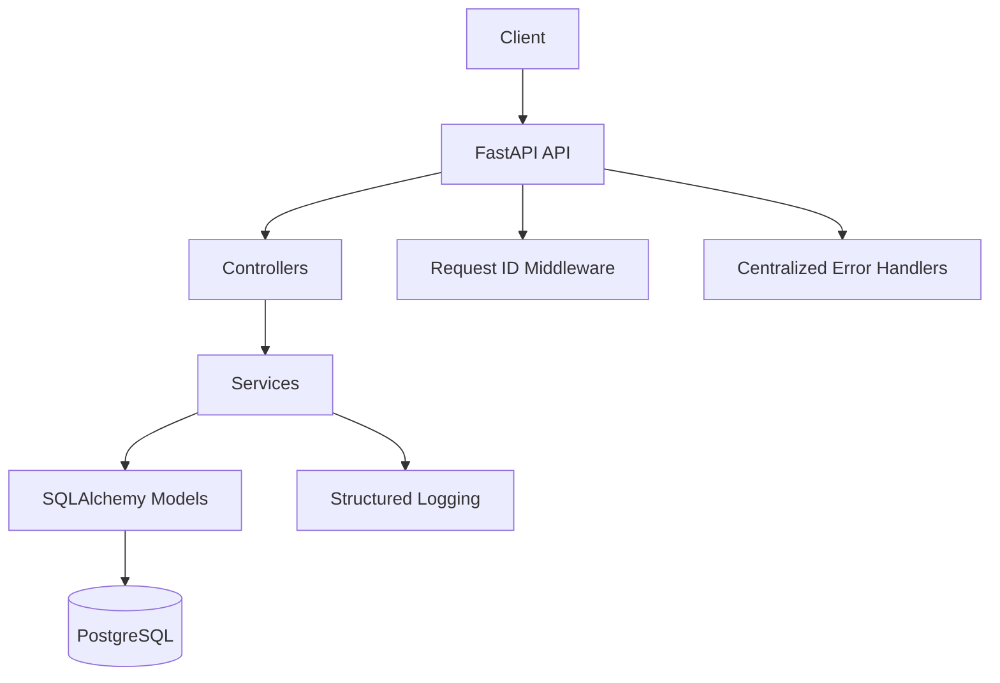
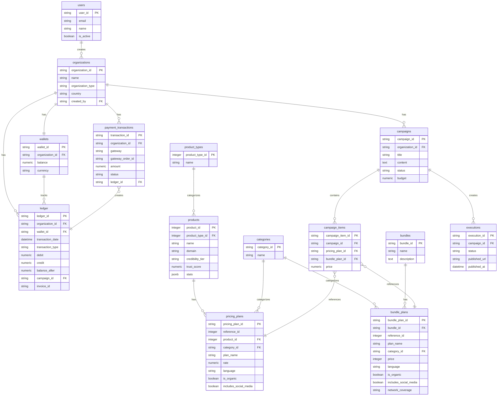

# InBriefs Backend API

Digital PR Platform backend built with FastAPI and PostgreSQL.

## Architecture



## Database Schema



## Key Features

### Business Rules
- Users can only belong to **one active organization**
- Database constraints enforce rules at data layer
- Partial unique constraint: `(user_id, is_active=TRUE)`


## Quick Start

```bash
# Start backend and database
docker-compose up --build -d backend

# API available at http://localhost:8000
# Docs at http://localhost:8000/docs
```

## API Examples

```bash
# Create user
curl -X POST "http://localhost:8000/users/" \
  -H "Content-Type: application/json" \
  -d '{"email": "test@example.com", "name": "Test User"}'

# Create organization
curl -X POST "http://localhost:8000/organizations/?owner_id=USER_ID" \
  -H "Content-Type: application/json" \
  -d '{"name": "Test Agency", "organization_type": "AGENCY"}'
```

## Tech Stack

- **FastAPI** - Web framework
- **PostgreSQL** - Database
- **SQLAlchemy** - ORM
- **Docker** - Containerization
